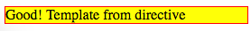

AngularJS1 Directive Template Url Demo
======================================

Use template from a standalone template file.

```
npm install
http-server . -c-1 -o
```



Resources
---------

- AngularJS1: https://angularjs.org/
- directive api: <https://docs.angularjs.org/api/ng/service/$compile#directive-definition-object>
- $element api: <https://docs.angularjs.org/api/ng/function/angular.element#angularjs-s-jqlite>